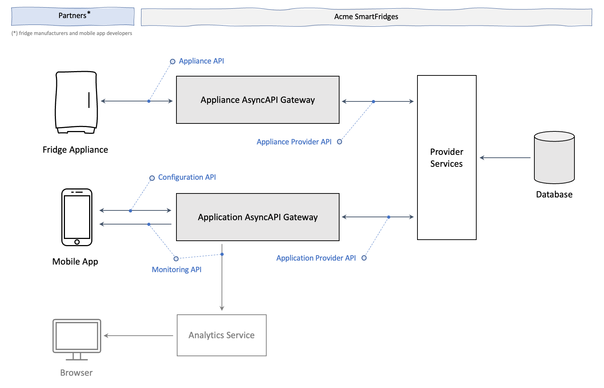

# Async API Management Use Case: Acme SmartFridges

> Resources, applications and services for the Acme SmartFridges AsyncAPI Management use case.

## Overview

## AsyncAPI Specifications

- [Appliance Provider API](specs/appliance-provider-api-v1.yml)
- [Application Provider API](specs/application-provider-api-v1.yml)

> **Note:** The consumer API specifications are created based on the provider API specifications.

## Applications and Services

- [Database](database/README.md)
- [Provider Services](provider-services/README.md)
- [Fridge Appliance Simulator](fridge-appliance-simulator/README.md)
- [MyFridge Consumer App](myfridge-consumer-app/README.md)
